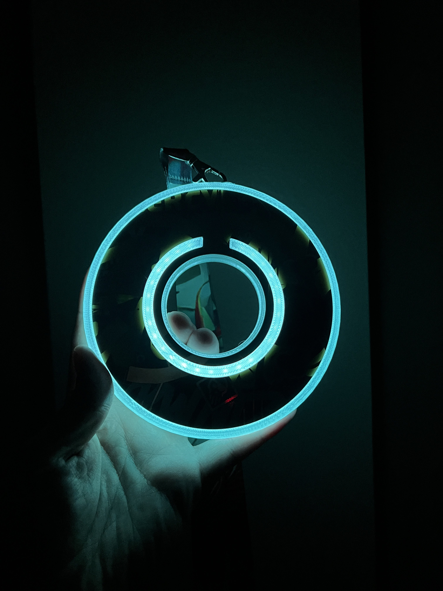
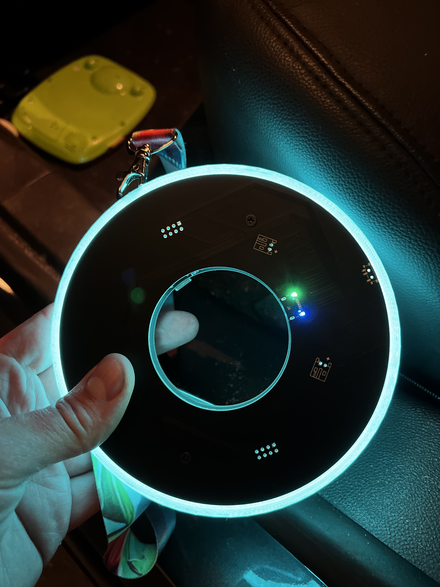
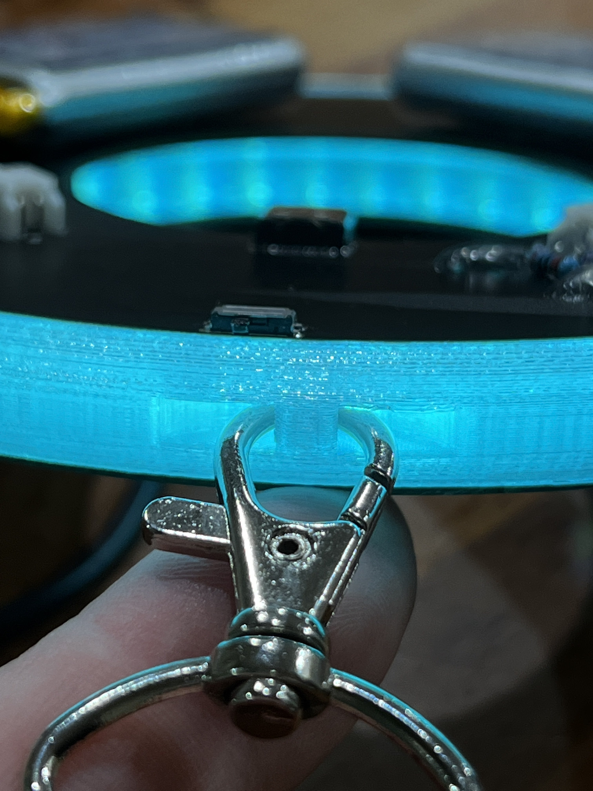
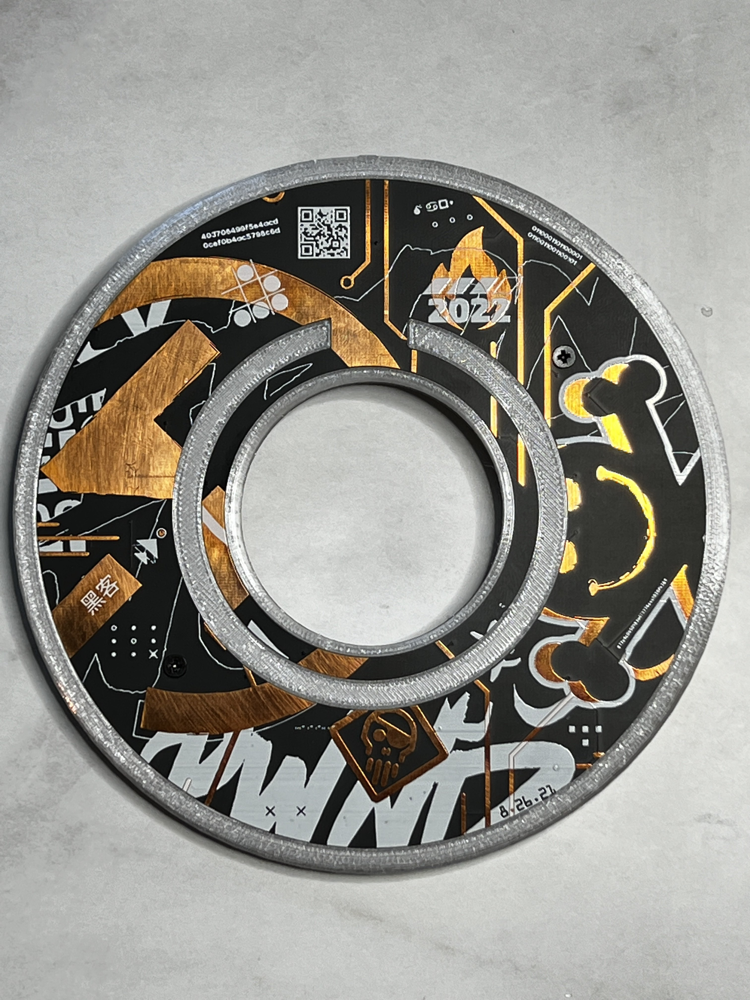
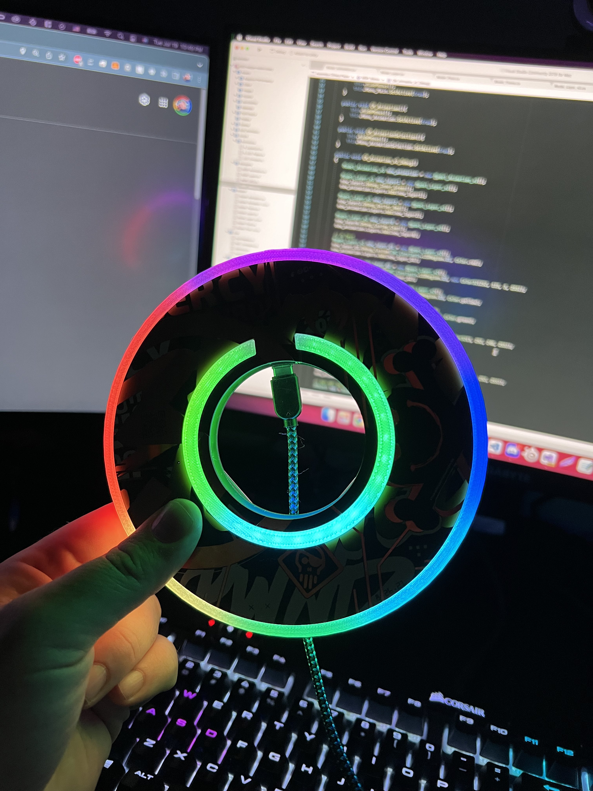
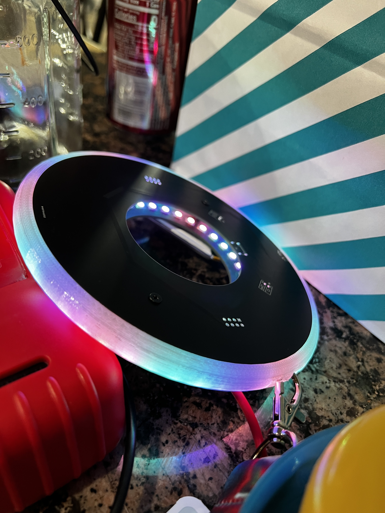
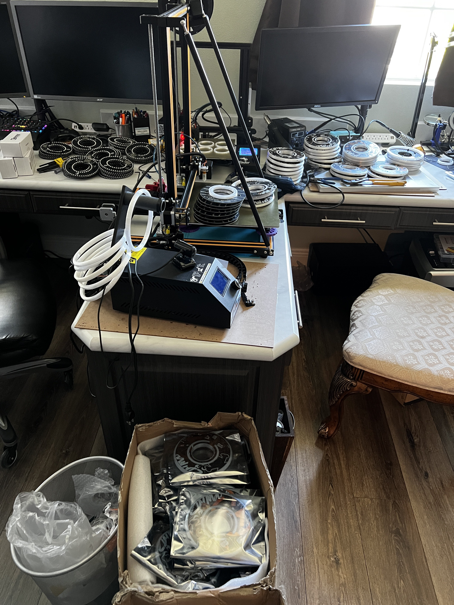

# Ironwood Cyber Team - DC30  Tron Badge  

## Pcb devs:
- kimboslice
- notthatguy
- joehacksalot

## Embedded Software devs:
- notthatguy
- joehacksalot

## Companion app dev: 
- Shiloh

## Website devs:
- LeetPanda
- Spaghetti Code  

# Link to Repos
[Schematics](https://github.com/Ironwood-Cyber/dc30-badge-hw)
[Source](TODO)

# Badge Images:

# Behind the Scenes/Making of the badge Images:

