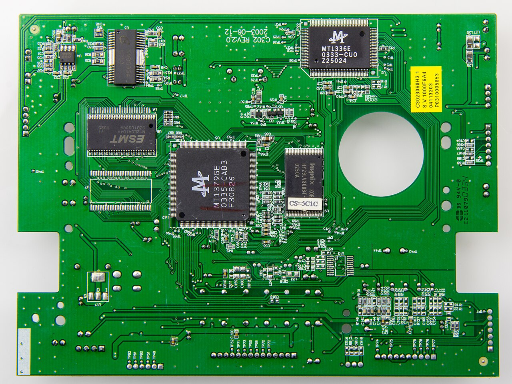
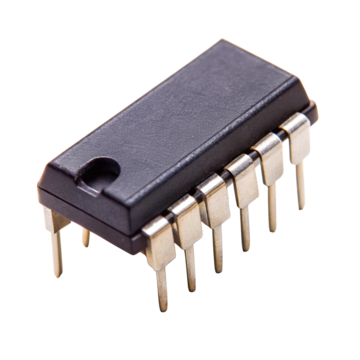
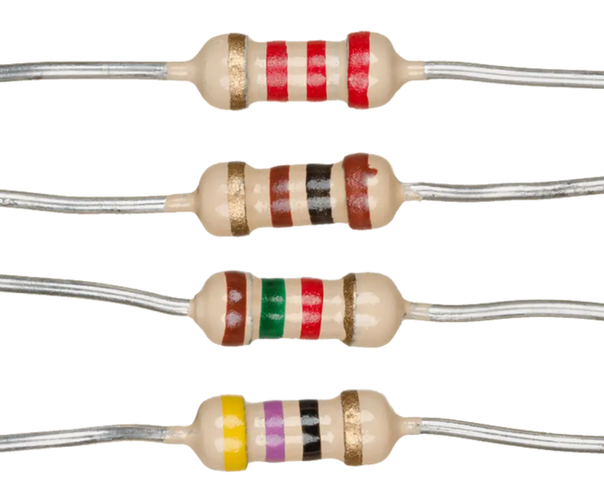
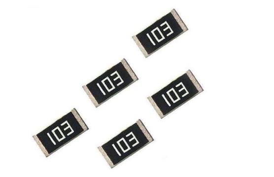
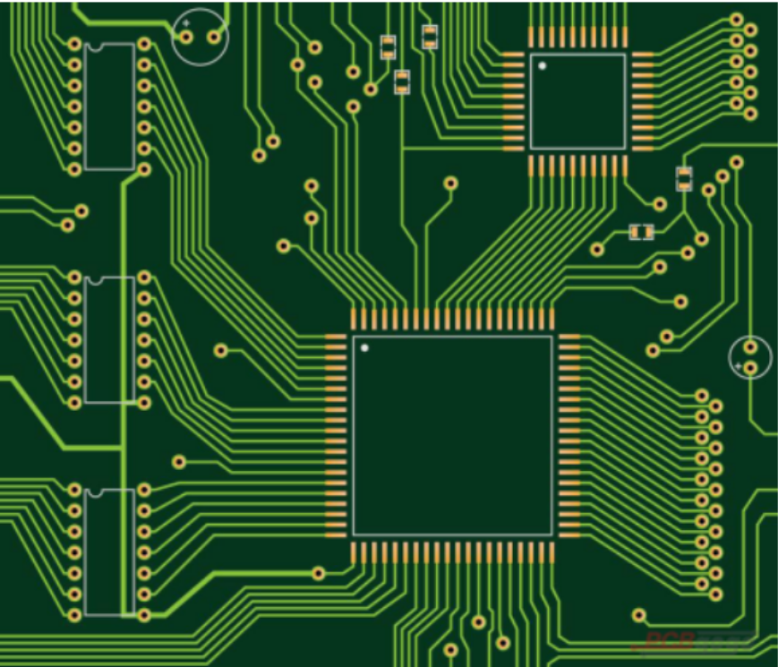

# Badgelife Village SAOs (DC34 / 2026)
- Image
## Level 1
- WIP 1
- WIP 2
## Level 2
- WIP 1
- WIP 2
## Links
- WIP
## Developers
- GhostGlitch

# Soldering 101

## I. The Basics & Vocabulary
* **Soldering:** 
    * The process of making an electrical connection by melting low-temperature metal alloys around component leads
    * Soldering is just as much an “Art” as it is a “Science” 
    * Pronounced “soddering” in American English – the “l” is silent!

* **Vocabulary**
    * Circuit Board - the board part without components
    * PCBA (Printed Circuit Board Assembly) - The circuit board along with all of its components
    

    * Components - the parts on the board
    * IC (Integrated Circuit) - Multiple components (like resistors, transistors, and capacitors) packaged together into a single unit
    

    * Pins - each individual metal lead on a component
    * Through hole component – has leads that physically pass through the board
    

    * Surface mount component – is flat and adheres to one side of a board
    

    <li>
      

      

      <li> Copper plate - the copper ground plane inside the board </li>
      <li> Trace – the underlying metal that connects components on a board (can be difficult to see – light green in this photo) </li>
      <li> Pad – the exposed metal that components adhere to (gold in this photo) </li>
      

      

      

    </li>

## II. The Soldering Process

## III. Safety

## IV. Level 1 SAO Guide

## V. Level 2 SAO Guide