<h1 id="badgelife-village-saos-dc34--2026">Badgelife Village SAOs (DC34 / 2026) </h1>
<h1 id="soldering-101">Soldering 101 </h1>
<h2 id="i-the-basics--vocabulary">I. The Basics &amp; Vocabulary </h2>
<ul>
  <li><strong>Soldering:</strong>
    <ul>
      <li>The process of making an electrical connection by melting low-temperature metal alloys around component leads</li>
      <li>Soldering is just as much an “Art” as it is a “Science”</li>
      <li>Pronounced “soddering” in American English – the “l” is silent!</li>
    </ul>
  </li>
  <li><strong>Vocabulary:</strong>
    <ul>
      <li>Circuit Board - the board part without components </li>
      <li>PCBA (Printed Circuit Board Assembly) - The circuit board along with all of its components 
        

      </li>
      <li> Components - the parts on the board </li>
      <li> IC (Integrated Circuit) - Multiple components (like resistors, transistors, and capacitors) packaged together into a single unit
        

      </li>
      <li>Pins - each individual metal lead on a component </li>
      <li>Through hole component – has leads that physically pass through the board 
        

      </li>
      <li> Surface mount component – is flat and adheres to one side of a board 
        

      </li>
      <li> Copper plate - the copper ground plane inside the board </li>
      <li> Trace – the underlying metal that connects components on a board (can be difficult to see – light green in this photo) </li>
      <li> Pad – the exposed metal that components adhere to (gold in this photo) 
        

      </li>
      <li> Silk screen – the designs/writing on a board </li>
      <li> Solder Mask - a protective layer applied over printed circuit board copper traces to prevent short circuits, stop solder bridging, and block environmental corrosion. Also gives boards fun colors! 
        
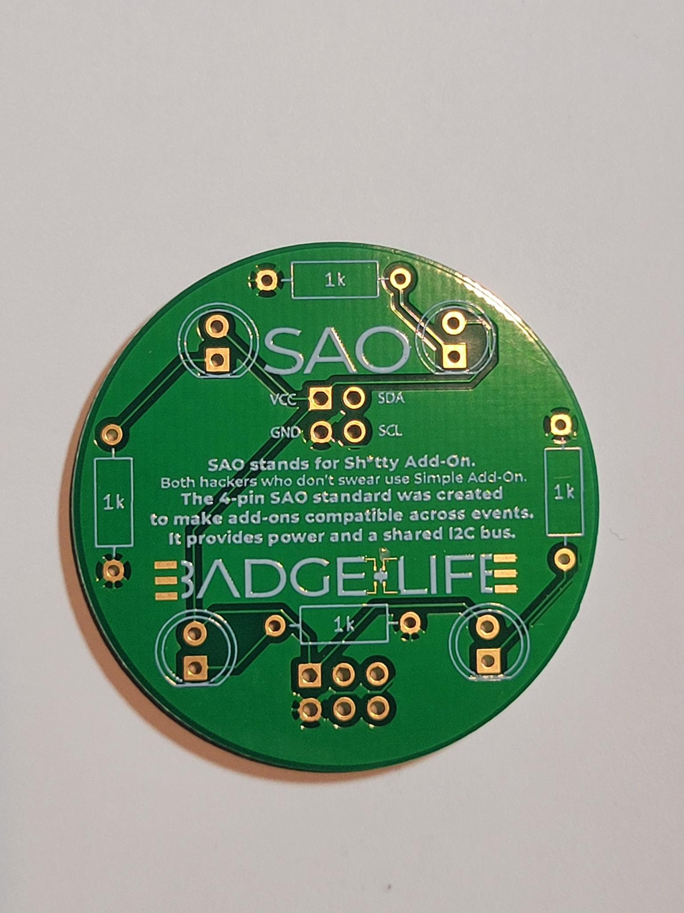

      </li>
      <li> Tinning – Putting a small amount of solder on the tip of the iron to protect it/prevent oxidation </li>
      <li> Soldering Iron 
        

      </li>
      <li>Tip cleaning surface (sponge or brass) 
      

      </li>
    </ul>
  </li>
  <li><strong>Soldering Safety:</strong>
    <li>THIS WOMAN NO LONGER HAS FINGERPRINTS!!!!! DO NOT HOLD THE IRON LIKE A PEN. ONLY HOLD THE PLASTIC/RUBBER HANDLE
    
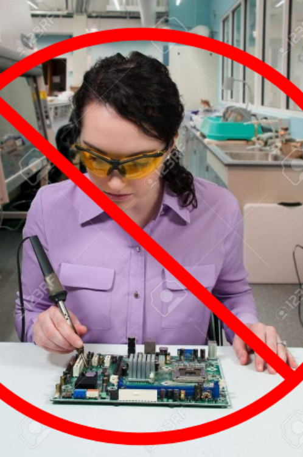

    </li>
    <li>The components, especially the exposed metal parts, will also get hot!</li>
    <li>Be aware of what is around you</li>
    <li>Tin the tip and return the iron to the holder when you are not soldering. Tinning the tip prevents oxidation and damage to the iron</li>
    <li>Always tin the tip of the iron when you are done soldering</li>
    <li>Don’t solder while circuit is powered</li>
    <li>Use a well ventilated and lighted work space</li>
    <li>Don’t touch the solder tip – it’s hot (duh)</li>
    <li>Static discharge protection – not a hazard for you but can trash some sensitive components</li>
    <li>Watch for flying leads when clipping them</li>
  </li>
  <li><strong>Soldering Process:</strong>
    <li>Turn on soldering iron and let it get to temperature</li>
    <li>Tin the tip using a small amount of solder</li>
    <li>Clean the tip using a sponge or brass tip cleaner</li>
    <li>Tin the tip again</li>
    <li>Install the component and hold in place with a physical connection (you can use tweezers if you want! don’t burn your hands!)</li>
    <li>Heat the component lead and the circuit board pad – ensure the tip is touching BOTH the component and the pad</li>
    <li>Touch solder to the component lead and pad - melt the right amount of solder (art)</li>
    <li>You'll figure out what the right amount is with practice! Start with less, but it's ok if you use too much</li>
    <li>Remember, heat transfer is more important than pressure!</li>
    <li>The melting solder will flow around the joint in a process called wetting</li>
    <li>Surface tension will produce a nice Hershy’s Kiss looking joint
      
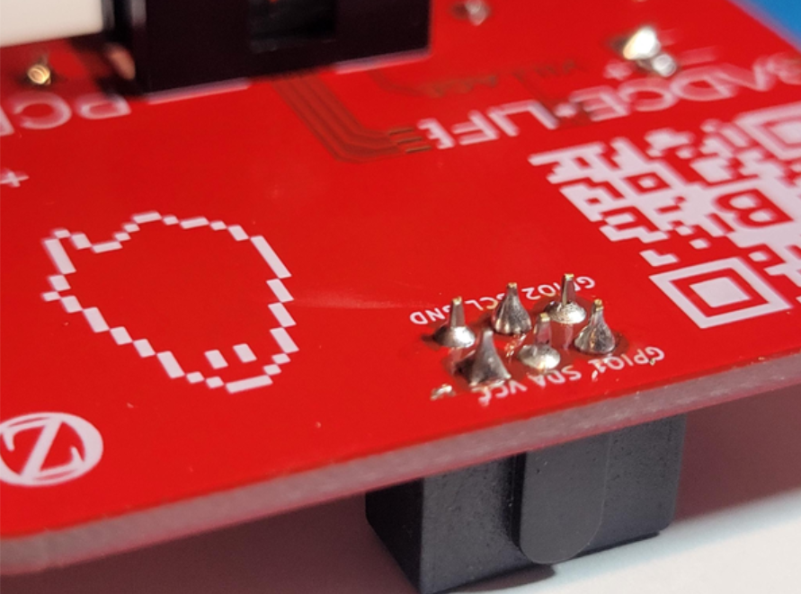

    </li>
    <li>Remove solder</li>
    <li>Keep the tip of the iron in place a bit longer</li>
    <li>Remove heat (art)</li>
    <li>Allow the joints to cool</li>
    <li>Inspect the connection (art and good eye)</li>
    <li>Clip excess leads if needed</li>
    <li>Cold solder joints are the cause of most circuit problems! (Don’t ask us for proof)
      
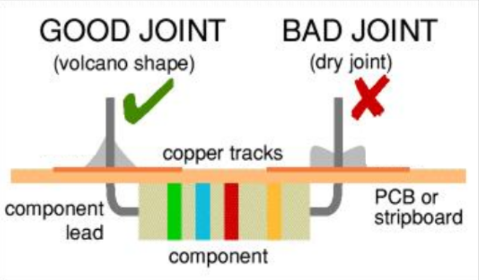

    </li>
    <li>If you joint is bad, there are a few options:</li>
    <ul>
      <li>Rework: heat the joint a bit more. Don’t add more solder until you’ve tried reheating/are sure you need it</li>
      <li>If there’s too much solder, use a copper braid. Press it to the joint, then press your iron to the braid. The braid will absorb some of the solder
      
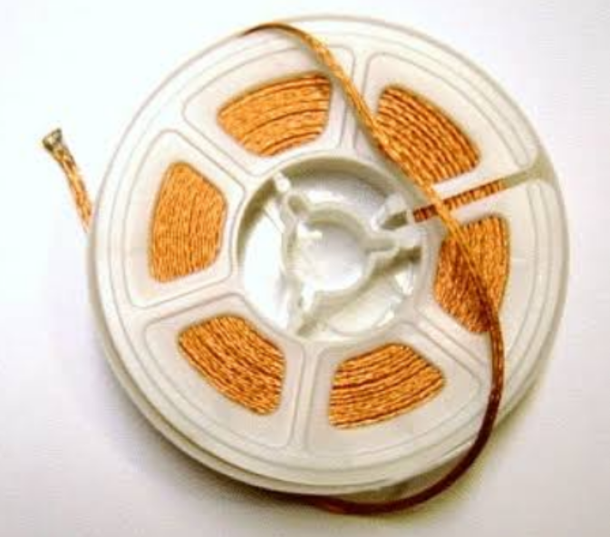

      </li>
      <li>Don’t be afraid to ask for help!</li>
    </ul>
  </li>
  <li><strong>Your turn!
    <ul>
      <li>All components should be in the bags</li>
      <li>Get your LEDs from the front table</li>
      <li>The silkscreen (writing) on the board will show you which way the components go, but you can ask a volunteer if you’re not sure!</li>
    </ul>
  </li>
  <li><strong>Level 1 Guide:
    <ul>
      <li>Resistors:
        <li>Resistors don't have an orientation! Put them any which way you like</li>
        <li>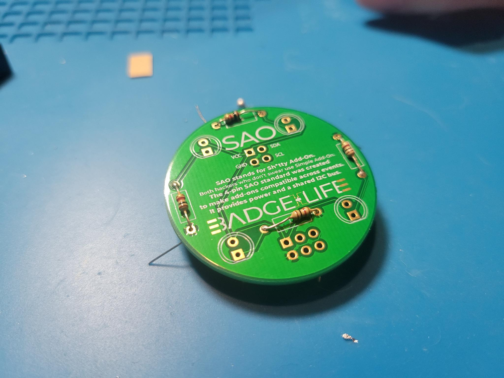</li>
        <li>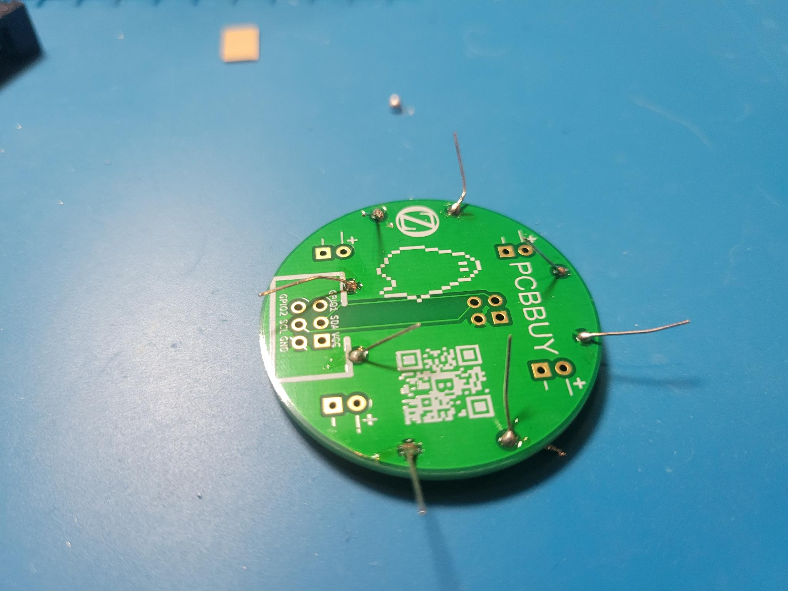</li>
        <li>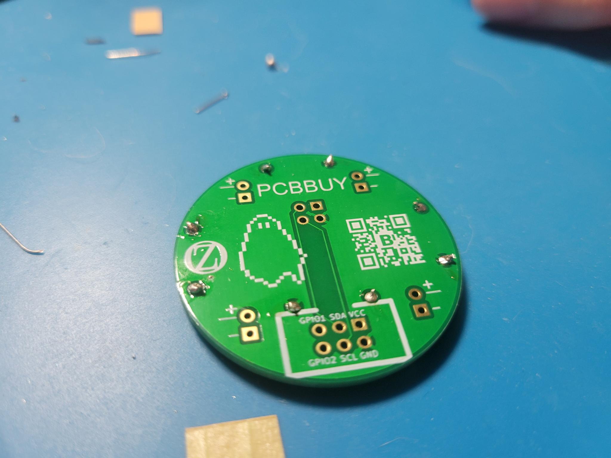</li>
      </li>
      <li>LEDs:
        <li>LEDS HAVE AN ORIENTATION! There is a right way and a wrong way. The long end is positive</li>
        <li>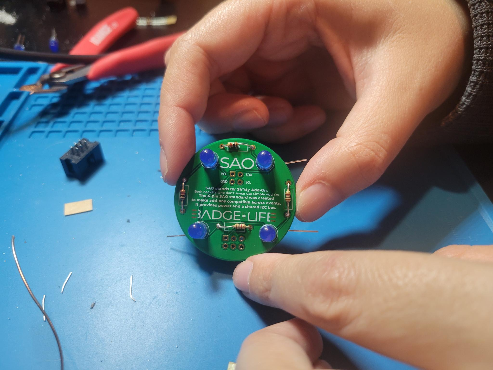</li>
        <li>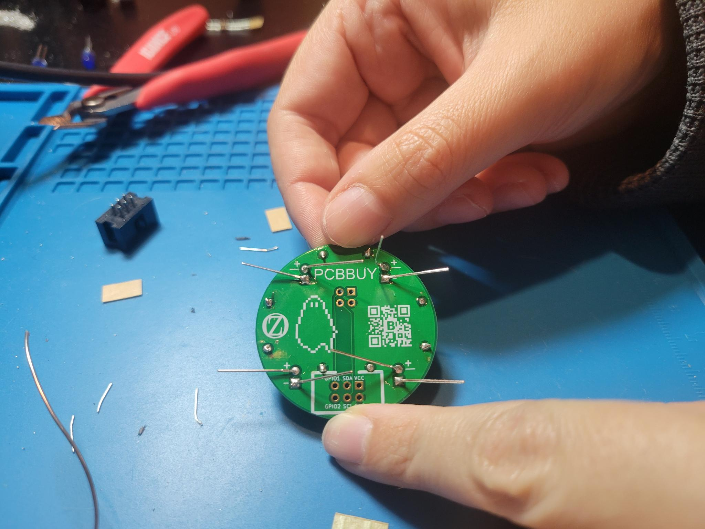</li>
        <li>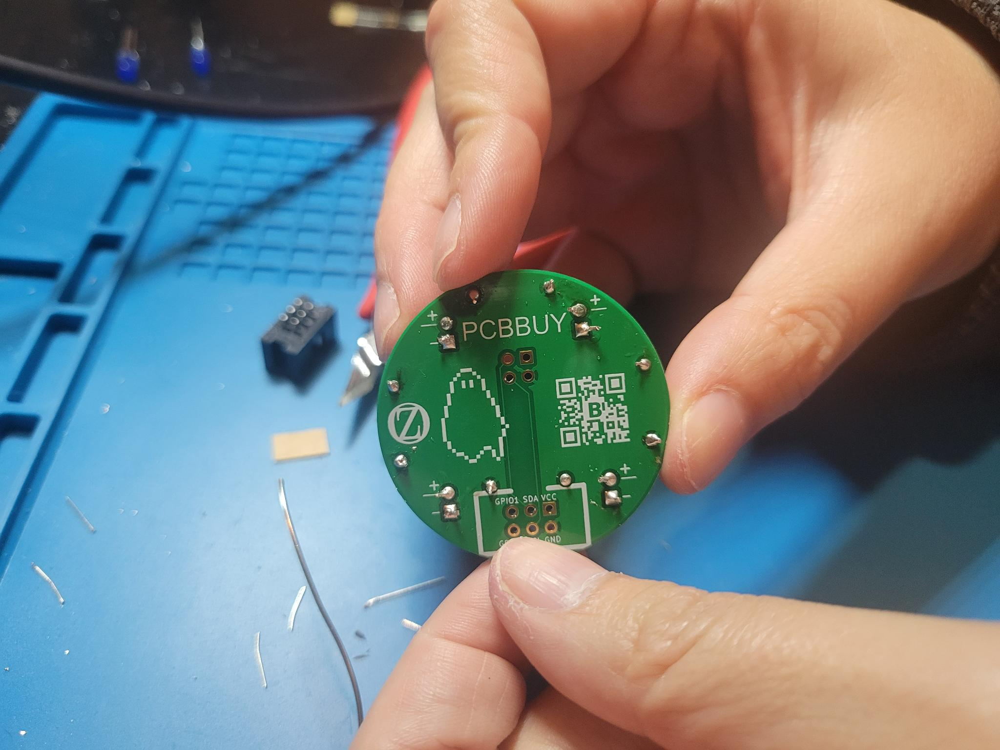</li>
      </li>
      <li>SAO v2.0 Connector:
        <li>This connector has an orientation! The gap in the housing matches the gap on the silkscreen</li>
        <li>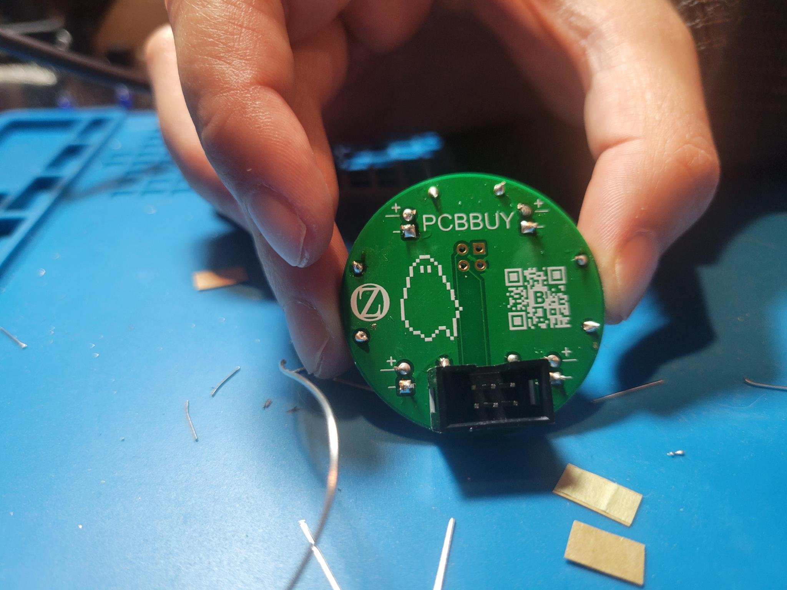</li>
        <li>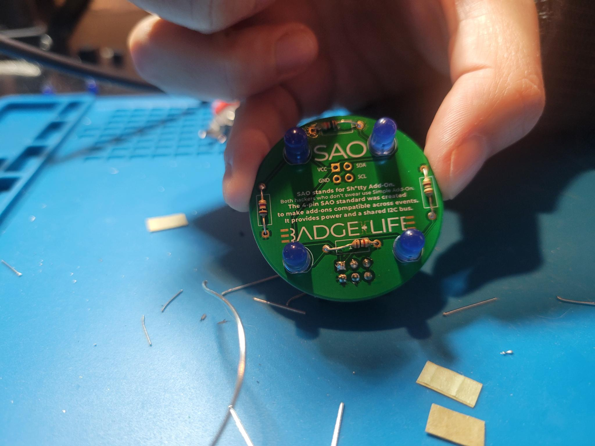</li>
      </li>
      <li>SAO v1.0 Connector:
        <li>This connector doesn't have an orientation! Put it any which way you like</li>
        <li>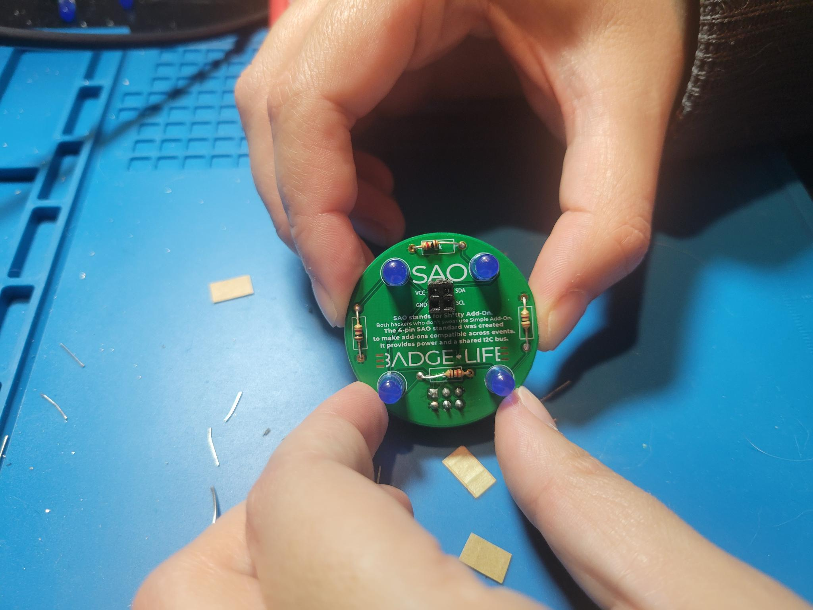</li>
        <li>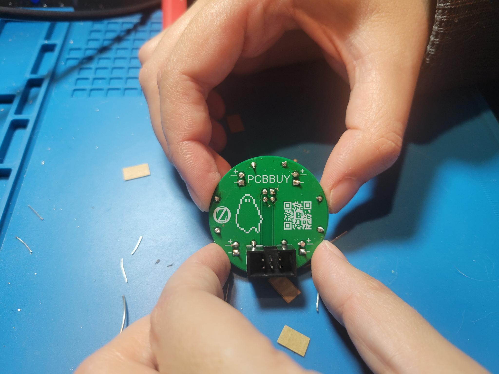</li>
      </li>
    </ul>
  </li>
</ul>
