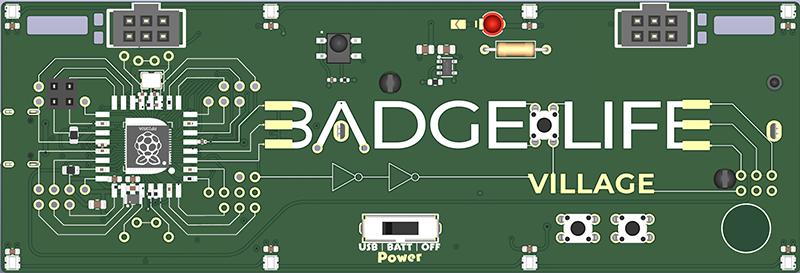

# Badgelife Village Badge (DC34 / 2026)



Meet Badgey Bodgerton, the Badgelife Village badge. Badgey needs your help finishing a few factory-omitted connections before the badge can reach maximum bling.

This guide covers the Power Boost bodge wire, the Distress Beacon LED, resistor, and buzzer, and firmware recovery using the badge's DFU/BOOTSEL mode. It intentionally does not reveal the challenge answers.

## Specifications

- RP2354 microcontroller with integrated flash
- Eight addressable RGB NeoPixel LEDs
- Three tactile user buttons
- One user-installed 3 mm challenge LED and polarized buzzer
- USB-C power, USB CDC serial CLI, and UF2 firmware flashing
- Single-cell 18650 battery, charging, and protection circuitry
- Two Simple Add-On (SAO) v2 headers
- An Infrared receiver
- And lots of secrets to uncover!

## Before You Solder

You will need:

- A temperature-controlled soldering iron
- Electronics solder and appropriate ventilation
- Flush cutters
- Tweezers or small pliers
- The supplied bodge wire, 3 mm LED, 1 kΩ (1K) resistor, and buzzer
- A multimeter with continuity mode (recommended)

{: .warning }
> **Disconnect all power before soldering.** Turn the badge off, unplug USB, and remove the battery. Allow the iron and board to cool before handling or reconnecting power. Inspect both sides for solder bridges and clipped leads.

## Open the Badge CLI

Use a USB **data** cable to connect the badge to a computer, then open its USB serial port at **115200 baud**. Commands are not case-sensitive.

1. Type `ctf` to open the challenge list.
2. Complete **The Beginning** to unlock **Power Boost**.
3. Enter a challenge by typing its number.
4. Type `activate` to run or replay that challenge.

## Challenge 2: Power Boost Bodge Wire

1. Turn the badge off, unplug USB, and remove the battery.
2. Locate the two separated exposed-copper sections in the **A** of `BADGELIFE`.
3. Cut the supplied wire to the shortest length that comfortably reaches both points without being pulled tight.
4. Strip and tin a small amount at each end. Do not leave enough exposed wire to touch nearby artwork or pads.
5. Tin both connection points with a small amount of solder.
6. Hold the wire flat against the board and solder one end in place.
7. Check the routing, then solder the other end.
8. Trim any excess conductor and inspect for bridges or loose strands.
9. MAKE SURE TO TRIM THE EXCESS WIRE BEHIND THE BATTERY COMPARTMENT OR THE BATTERY MAY NOT FIT!
10. If you have a multimeter, verify continuity across the bodge and confirm that neither joint touches unintended nearby copper.
11. Reinstall the battery or reconnect USB, open **Power Boost**, and type `activate`.

## Challenge 3: Distress Beacon LED, Resistor, and Buzzer

Parts needed: a **3 mm LED**, a **1 kΩ (1K) axial resistor**, and a **polarized buzzer**. Viewed from the front with `BADGELIFE` readable, the LED is at the top center and the horizontal resistor is immediately to its right. The buzzer installs on the back of the badge next to the `Peripheral +/-` marking.

### Install the 1 kΩ resistor

The resistor is not polarized, so either lead may go into either resistor pad.

1. Turn the badge off, unplug USB, and remove the battery.
2. Confirm that the resistor is **1 kΩ (1K)**. Its common color code is **brown-black-red** with a tolerance band.
3. Bend the leads so they pass cleanly through the horizontal footprint to the right of the LED without stressing the resistor body.
4. Insert the resistor and slightly spread the leads on the back to hold it in place.
5. Solder one lead, check that the part is straight, and then solder the second lead.
6. Trim both leads close to the finished joints without cutting into the solder fillets.

### Install the 3 mm LED

An LED **is polarized** and must be installed in the correct direction.

| Front-view pad | LED connection | Part indicator |
|:--|:--|:--|
| Left, square pad | Cathode (`K`, negative side) | Shorter lead and flat side of the LED body |
| Right, round pad | Anode (`A`, +3.3 V side) | Longer lead |

1. Hold the badge with the front artwork facing you and `BADGELIFE` readable.
2. Put the LED's **short cathode lead** into the **left square pad**.
3. Put the LED's **long anode lead** into the **right round pad**.
4. Solder one lead first, then check that the LED is straight and seated at the desired height.
5. Solder the second lead and reflow the first if needed.
6. Trim both leads and inspect the joints for full wetting, cold joints, or bridges.

{: .warning }
> Do not rely only on lead length if the LED leads have already been cut. Use the flat side of the LED body to identify the cathode, and confirm that it faces the left square pad.

### Install the buzzer

The buzzer is polarized and mounts on the **back of the badge**, beside the printed `Peripheral +/-` marking. Its wire colors identify polarity: **red is positive (+)** and **black is negative (-)**.

1. Keep USB disconnected and the battery removed.
2. Turn the badge over and locate the two buzzer connections beside `Peripheral +/-`.
3. Connect the **red wire** to `Peripheral +`.
4. Connect the **black wire** to `Peripheral -`.
5. Position the buzzer body on the back of the badge and route both wires so they do not cross exposed pads or interfere with nearby parts.
6. Solder one wire, recheck the wire colors and polarity, and then solder the second wire.
7. Inspect both joints for bridges and make sure no bare wire can touch nearby copper.

### Test the Distress Beacon

1. Reinstall the battery or reconnect USB and return to the CLI.
2. Type `ctf`, then select **Distress Beacon**.
3. Type `activate` to replay it.
4. Decode the message and enter it at the challenge prompt to complete the challenge.

Note: If it does not light, disconnect all power and check the LED orientation, 1 kΩ resistor, and solder joints. The buzzer should still be installed with its polarity matched to `Peripheral +/-`.

## Reflashing the Firmware

The badge uses the RP2350 UF2 bootloader.

### Install a prebuilt UF2

1. Download the correct `firmware.uf2` for the Badgelife Village badge.
2. Connect the badge to your computer with a USB data cable.
3. Enter DFU/BOOTSEL mode using either method:
   - **Power-on method:** With the badge unpowered, hold **DFU**, connect USB or switch the badge on, and then release **DFU**.
   - **Reset method:** While USB is connected, hold **DFU**, tap **RESET**, and then release **DFU**.
4. A removable drive named `RP2350` or `RPI-RP2` should appear.
5. Copy `firmware.uf2` to that drive.
6. Wait for the copy to finish. The drive will disappear and the badge will reboot automatically into the new firmware.

{: .note }
> Holding RESET by itself does not enter DFU/BOOTSEL mode. If no UF2 drive appears, try another USB data cable or port and repeat the sequence while keeping DFU held through the power-on or reset action.

### Build and flash from source

Install Python and [PlatformIO Core](https://docs.platformio.org/en/latest/core/installation/index.html), then run these commands from the firmware repository.

Build only:

```text
python flash.py -b
```

The UF2 will be written to:

```text
.pio/build/badge_hw/firmware.uf2
```

Build and flash without opening the serial monitor:

```text
python flash.py -n
```

The flash tool first looks for an existing UF2 drive and then attempts an automatic 1200-baud reset. If automatic recovery fails, it prompts you to hold DFU/BOOTSEL and tap RESET or reconnect USB.

Open only the serial monitor:

```text
python flash.py --monitor
```

## Troubleshooting

| Problem | What to check |
|:--|:--|
| No serial port | Confirm that the cable supports data, reconnect the badge, and check the operating system's serial-device list. |
| Power Boost is not detected | Disconnect power, inspect both bodge joints, check continuity across the wire, and remove bridges to nearby copper. |
| The beacon does not flash | Disconnect power and confirm that the LED's cathode is in the left square pad, the 1 kΩ resistor is installed, and all four joints are sound. |
| The buzzer does not work in a feature that uses it | Disconnect power and confirm that its positive lead connects to `Peripheral +`, its negative lead connects to `Peripheral -`, and both joints are sound. |
| The UF2 drive does not appear | Keep DFU held while powering on, or keep DFU held while tapping RESET. Release DFU only afterward. |
| The badge is unresponsive after flashing | Re-enter DFU/BOOTSEL mode and copy a known-good badge UF2 again. |

## Links

- [Badge help and updates](https://badge.life/badge)
- Badge Firmware Source (After con)
- [PlatformIO Core installation](https://docs.platformio.org/en/latest/core/installation/index.html)

## Developer

- Jeff "BigTaro" — [bigtaro.net](https://bigtaro.net)
