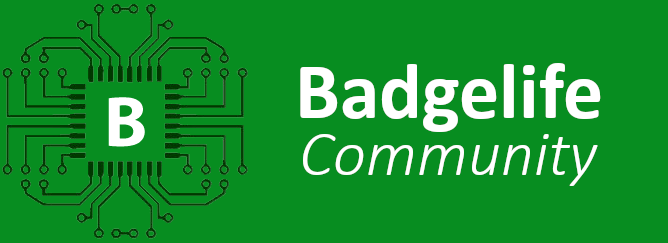
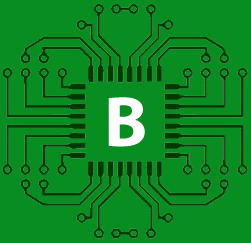

# Welcome to BadgeLife!

Welcome to **BadgeLife**, the home for the #Badgelife community! Here we will be hosting things like [Badge Archive](/archive/archive), the upcoming Badge.life API, and more. Currently it's mainly the home for our Badgelife Community (aka Village) Schedule.

## Village / Community Schedule:
All events not labled **CREATOR STAGE** take place in the #Badgelife Community area.

| Date | Time | Speaker/Host | Event Title | Badge Drop Table 1 | Badge Drop Table 2 | Volunteer - Museum | Volunteer - SAO Wall | Volunteer - Gopher | Creator POC |
| :---: | :---: | :---: | :---: | :---: | :---: | :---: | :---: | :---: | :---: |
| **THURSDAY** | --- | --- | --- | --- | --- | --- | --- | --- | --- |
| **Thurs 8/7** | 3:00 PM | (Not Open To Humans) | (Not Open To Humans) | (Not Open To Humans) | (Not Open To Humans) | Village Load-In | Wrickert | True | ReanimationXP |
| **Thurs 8/7** | 5:00 PM | (Not Open To Humans) | (Not Open To Humans) | (Not Open To Humans) | (Not Open To Humans) | Post Load-In |  |  |  |
| **FRIDAY** | --- | --- | --- | --- | --- | --- | --- | --- | --- |
| **Fri 8/8** | 9:00 AM | Set Up | (Not Open To Humans) | (Not Open To Humans) | (Not Open To Humans) | Panda |  |  | ReanimationXP |
| **Fri 8/8** | 9:30 AM | Set Up | (Not Open To Humans) | (Not Open To Humans) | (Not Open To Humans) | Panda | Fluxfluxflux |  | ReanimationXP |
| **Fri 8/8** | 10:00 AM |  |  | **SaO MANY SAOs** - Vortex1 / Coruscant Ventures |  | Panda | Fluxfluxflux |  | ReanimationXP |
| **Fri 8/8** | 10:30 AM |  |  | **GigaGeiger** - Penzz |  | Panda | Fluxfluxflux |  | ReanimationXP |
| **Fri 8/8** | 11:00 AM | Panda | Badgelife: Lessons from Years of Do’s, Don’ts, and Last-Minute Saves | **Black Badge Raffle TCG** - Sonicos |  | ozma.of.oz | LqqkOut | Fluxfluxflux | ReanimationXP |
| **Fri 8/8** | 11:30 AM |  |  | **Submarine Badge/FrogStar Badge/FightDystopia Badge** - BigTaro |  | ozma.of.oz | LqqkOut | Fluxfluxflux | ReanimationXP |
| **Fri 8/8** | 12:00 PM | Lipo | Z80 Badge Talk |  |  | ozma.of.oz | LqqkOut |  | ReanimationXP |
| **Fri 8/8** | 12:30 PM |  |  |  |  | ozma.of.oz | LqqkOut |  | ReanimationXP |
| **Fri 8/8** | 1:00 PM | ozma.of.oz & LqqkOut | Badge Necromancy Presentation |  |  | Nferno | .Kbyr. | Spacebreakfast | ReanimationXP |
| **Fri 8/8** | 1:30 PM |  |  |  |  | Nferno | .Kbyr. | Spacebreakfast | ReanimationXP |
| **Fri 8/8** | 2:00 PM | pcbhamster | An Artistic Approach to PCB Design | **Black Badge Raffle TCG - Sonicos** |  | Nferno | .Kbyr. | Spacebreakfast | ReanimationXP |
| **Fri 8/8** | 2:30 PM |  |  |  |  | Nferno | .Kbyr. | Spacebreakfast | ReanimationXP |
| **Fri 8/8** | 3:00 PM | Lipo & d1stinctmind | Trivia | **Hack 'em Crack 'em Robots** - NilbinSec |  | pcbhamster | fg |  | ReanimationXP |
| **Fri 8/8** | 3:30 PM | Lipo & d1stinctmind | Trivia | **Shitty Kitty v2** - Lipo |  | pcbhamster | fg |  | ReanimationXP |
| **Fri 8/8** | 4:00 PM | Lipo & d1stinctmind | Trivia | **Hak4Kidz** - Heal-Hak4Kidz |  | Penzz | Penzilzz | Heal-Hak4Kidz | ReanimationXP |
| **Fri 8/8** | 4:30 PM | Lipo & d1stinctmind | Trivia | **SaO MANY SAOs** - Vortex1 / Coruscant Ventures |  | Penzz | Penzilzz | Heal-Hak4Kidz | ReanimationXP |
| **Fri 8/8** | 5:00 PM | Lipo & d1stinctmind | Trivia |  |  | Penzz | Penzilzz | Heal-Hak4Kidz | ReanimationXP |
| **Fri 8/8** | 5:30 PM | Lipo & d1stinctmind | Trivia | **GigaGeiger** - Penzz |  | Heal-Hak4Kidz | Trc3r42 |  | ReanimationXP |
| **Fri 8/8** | 6:00 PM | Doors Closed / Put Community to Bed |  |  |  | Heal-Hak4Kidz | Trc3r42 |  | ReanimationXP |
| **SATURDAY** | --- | --- | --- | --- | --- | --- | --- | --- | --- |
| **Sat 8/9** | 9:00 AM | Set Up | (Not Open To Humans) | (Not Open To Humans) | (Not Open To Humans) |  |  |  | ReanimationXP |
| **Sat 8/9** | 9:30 AM | Set Up | (Not Open To Humans) | (Not Open To Humans) | (Not Open To Humans) | MakeItHackin | Panda | drsheldoncooper | ReanimationXP |
| **Sat 8/9** | 10:00 AM |  |  | **SaO MANY SAOs** - Vortex1 / Coruscant Ventures |  | MakeItHackin | Panda | drsheldoncooper | ReanimationXP |
| **Sat 8/9** | 10:30 AM |  |  |  |  | MakeItHackin | Panda | drsheldoncooper | ReanimationXP |
| **Sat 8/9** | 11:00 AM |  |  | **Hack 'em Crack 'em Robots** - NilbinSec | **Black Badge Raffle TCG** - Sonicos | MakeItHackin | Panda | drsheldoncooper | ReanimationXP |
| **Sat 8/9** | 11:30 AM |  |  |  |  | Nferno | .Kbyr. | Spacebreakfast | ReanimationXP |
| **Sat 8/9** | 12:00 PM | Blenster | KiCAD Demo |  |  | Nferno | .Kbyr. | Spacebreakfast | ReanimationXP |
| **Sat 8/9** | 12:30 PM |  |  |  |  | Nferno | .Kbyr. | Spacebreakfast | ReanimationXP |
| **Sat 8/9** | 1:00 PM | Hamster | Coating your PCBs | **Shitty Kitty v2** - Lipo |  | Nferno | .Kbyr. | Spacebreakfast | ReanimationXP |
| **Sat 8/9** | 1:30 PM |  |  |  |  | Lipo | Fluxfluxflux | fg | ReanimationXP |
| **Sat 8/9** | 2:00 PM | vynra | "Making SAOs for Fun and No Profit" | **Black Badge Raffle TCG** - Sonicos |  | Lipo | Fluxfluxflux | fg | ReanimationXP |
| **Sat 8/9** | 2:30 PM |  |  |  |  | Lipo | Fluxfluxflux | Trc3r42 | ReanimationXP |
| **Sat 8/9** | 3:00 PM | BigTaro | So you want to make a badge? Badge Creation 101, from SAO to full #badgelife | **Laser\* Tag Badge** - dani.pink |  | Lipo | Fluxfluxflux | Trc3r42 | ReanimationXP |
| **Sat 8/9** | 3:30 PM |  |  |  |  | Wrickert | Muzzle | Trc3r42 | ReanimationXP |
| **Sat 8/9** | 4:00 PM | Bradan Lane, MakeItHackin, Panda | CREATOR STAGE - Badgemaker Panel |  |  | Wrickert | Muzzle | Trc3r42 | ReanimationXP |
| **Sat 8/9** | 4:30 PM | Bradan Lane, MakeItHackin, Panda | CREATOR STAGE - Badgemaker Panel |  |  | Wrickert | Muzzle |  | ReanimationXP |
| **Sat 8/9** | 5:00 PM |  |  | **SaO MANY SAOs** - Vortex1 / Coruscant Ventures |  | Wrickert | Muzzle |  | ReanimationXP |
| **Sat 8/9** | 5:30 PM |  |  |  |  | Wrickert | Muzzle |  | ReanimationXP |
| **Sat 8/9** | 6:00 PM | Doors Closed / Put Community to Bed |  |  |  | Wrickert | Muzzle |  | ReanimationXP |
| **SUNDAY** | --- | --- | --- | --- | --- | --- | --- | --- | --- |
| **Sun 8/10** | 9:00 AM | Set Up |  |  |  | ozma.of.oz | LqqkOut |  | ReanimationXP |
| **Sun 8/10** | 9:30 AM | Set Up |  |  |  | ozma.of.oz | LqqkOut |  | ReanimationXP |
| **Sun 8/10** | 10:00 AM |  |  |  |  | ozma.of.oz | LqqkOut | Acetolyne | ReanimationXP |
| **Sun 8/10** | 10:30 AM |  |  |  |  | ozma.of.oz | LqqkOut | Acetolyne | ReanimationXP |
| **Sun 8/10** | 11:00 AM | beckettcat | Chip Design Presentation |  |  | Beckettcat | znjp | Acetolyne | ReanimationXP |
| **Sun 8/10** | 11:30 AM |  |  |  |  | Beckettcat | znjp | Acetolyne | ReanimationXP |
| **Sun 8/10** | 12:00 PM |  |  |  |  | Beckettcat | znjp |  | ReanimationXP |
| **Sun 8/10** | 12:30 PM |  |  |  |  | Beckettcat | znjp |  | ReanimationXP |
| **Sun 8/10** | 1:00 PM | Doors Closed / Prep Loadout |  |  |  | Beckettcat | znjp |  | ReanimationXP |
| **Sun 8/10** | 1:30 PM | Loadout | (Not Open To Humans) |  |  | Wrickert | True |  | ReanimationXP |
| **Sun 8/10** |  | **FIN** |  |  |  |  |  |  |  |

### 📚 Explore The Badge Archive

Discover detailed information about a wide range of electronic badges:
- **Pictures:** High-quality images showcasing badge designs.
- **Schematics:** Circuit diagrams and technical drawings.
- **Source Code:** Firmware and software behind the badges.

Visit the [Badge Archive](/archive/archive) to explore more.

## Stay Updated

### 🆕 New and Upcoming Badges

Stay on top of the latest badge innovations in our [New Badges](archive/dc32/dc32) section:
- **Announcements:** Information on new and upcoming badges.
- **Submit Your Badge:** Share your DC32 badge information using the submission form [here](https://t.co/UhN5iChYvH) (credit: K4rm4ness).
- **Curated Lists:** View the latest curated list [here](https://t.co/JUbgMb3Lze) (credit: K4rm4ness).

Check out the [DC32 Badges](archive/dc32/dc32) page for more details.

## Maker Resources

Access essential resources to support your badge-making:
- **📝 Unofficial Specifications:** Detailed specs developed and within by our community.
- **📚 Guides & Best Practices:** Practical guides and tips shared by experienced makers.

## Get Involved

### 🛠 Contribute

Join our community and contribute:
- **Join Discussions:** Join the discords and participate in conversations about badge projects and concepts.
- **Submit Your Badge:** Have a badge you'd like to add? Submit a pull request with source code, schematics, or links to badge repos. Contribution instructions are available [here](https://github.com/badgelife/website).

## Latest Blog Posts

Catch up on recent articles and updates:


- [{{ post.title }}]({{ post.url }}) - {{ post.date | date: "%B %d, %Y" }}


## Join Us

We’re always looking for new members to join our vibrant community. Whether you’re a seasoned badge creator or just getting started, there’s a place for you here:
- **[Join the BadgeMakers Discord](https://discord.gg/R4jGhTqJ3J)**

