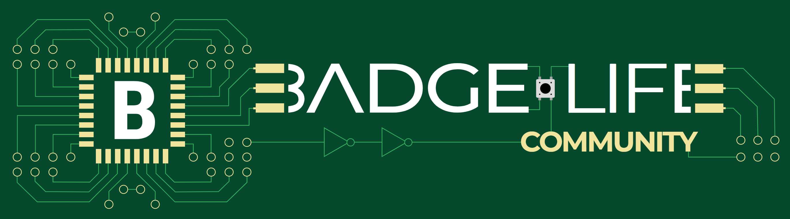
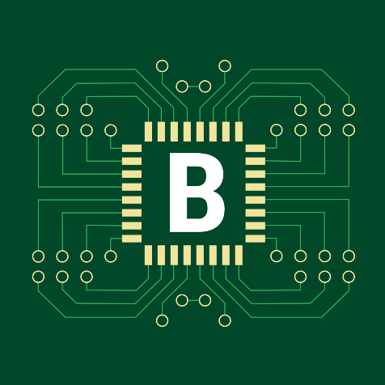

# Welcome to BadgeLife!
Welcome to **BadgeLife**, the home for the #Badgelife village! Here we will be hosting things like [Badge Archive](/badges), the upcoming Badge.life API, and more. Currently it's mainly the home for our Badgelife Village Schedule, [Badgelife Village Prospectus](/assets/files/Badgelife-Village-DEFCON-34.pdf), and more.  

Follow us on [BlueSky](https://bsky.app/profile/badgelife.bsky.social), and check us out on the [DC 34 Website](https://defcon.org/html/defcon-34/dc-34-villages.html#orga_41349)!
  
## DC34 Village Schedule:
All events listed here take place in the village. Most will be at our "silent disco" stage setup. Please be sure to thank our 2026 Village Sponsors at the bottom of this page! They really came through last year and are helping us fund this year as well!

<table class="schedule">
  <colgroup>
    <col class="col-time" />
    <col class="col-talk" />
    <col class="col-drops" span="2" />
    <col class="col-vols" span="3" />
  </colgroup>
  <thead>
    <tr>
      <th rowspan="2" class="hdr">Time</th>
      <th rowspan="2" class="hdr">Talk</th>
      <th colspan="2" class="hdr-drops">Badge Drops</th>
      <th colspan="3" class="hdr-vols">Volunteers</th>
    </tr>
    <tr>
      <th class="hdr-drops">Drop 1</th>
      <th class="hdr-drops">Drop 2</th>
      <th class="hdr-vols">Badgelife Museum</th>
      <th class="hdr-vols">Badge Genius Bar</th>
      <th class="hdr-vols">General</th>
    </tr>
  </thead>
  <tbody>

    <!-- ══════════════════════════════════════════════════════════ -->
    <!-- WEDNESDAY — AUGUST 5 · EARLY LOAD-IN (NOT OPEN TO PUBLIC) -->
    <!-- ══════════════════════════════════════════════════════════ -->
    <tr>
      <td colspan="7"><strong>WEDNESDAY — August 5 · Early Load-In</strong></td>
    </tr>
    <tr>
      <td>2:30 PM</td>
      <td colspan="6">Village Early Load-In — Not Open To Public</td>
    </tr>

    <!-- ══════════════════════════════════════════════════════════ -->
    <!-- THURSDAY — AUGUST 6 · LOAD-IN (NOT OPEN TO PUBLIC)        -->
    <!-- ══════════════════════════════════════════════════════════ -->
    <tr>
      <td colspan="7"><strong>THURSDAY — August 6 · Village Load-In</strong></td>
    </tr>
    <tr>
      <td>10:00 AM</td>
      <td colspan="6">Village Load-In — Not Open To Public (Panda, GhostGlitch Crew, LqqtOut)</td>
    </tr>
    <tr>
      <td>3:00 PM</td>
      <td colspan="6">Village Load-In (Continued) — Not Open To Public (Blinkingthing, Panda, GhostGlitch Crew, LqqtOut)</td>
    </tr>
    <tr>
      <td>5:00 PM</td>
      <td colspan="6">Post Load-In / Wrap</td>
    </tr>

    <!-- ══════════════════════════════════════════════════════════ -->
    <!-- FRIDAY — AUGUST 7                                          -->
    <!-- ══════════════════════════════════════════════════════════ -->
    <tr>
      <td colspan="7"><strong>FRIDAY — August 7</strong></td>
    </tr>
    <tr>
      <th rowspan="2" class="hdr">Time</th>
      <th rowspan="2" class="hdr">Talk</th>
      <th colspan="2" class="hdr-drops">Badge Drops</th>
      <th colspan="3" class="hdr-vols">Volunteers</th>
    </tr>
    <tr>
      <th class="hdr-drops">Drop 1</th>
      <th class="hdr-drops">Drop 2</th>
      <th class="hdr-vols">Badgelife Museum</th>
      <th class="hdr-vols">Badge Genius Bar</th>
      <th class="hdr-vols">General</th>
    </tr>
    <tr>
      <td>9:00 AM</td>
      <td colspan="6">Set Up — Not Open To Public</td>
    </tr>
    <tr>
      <td>9:30 AM</td>
      <td colspan="6">Set Up — Not Open To Public</td>
    </tr>
    <tr><td>10:00 AM</td><td></td><td></td><td></td><td>Acetolyne</td><td>Hamster</td><td>K4rm4</td></tr>
    <tr><td>10:30 AM</td><td></td><td><strong><a href="https://uberflux.com/product/PL-1471">MalO SAO</a></strong> &mdash; ParallelLogic</td><td><strong><a href="https://forms.gle/spmnMTaADVngRYsB8">Masonic33 Badge</a></strong> &mdash; heal</td><td>Acetolyne</td><td>Hamster</td><td>K4rm4</td></tr>
    <tr><td>11:00 AM</td><td><strong>Resurrecting Lost Badges: The Dark Art Of Badgelife Necromancy</strong> &mdash; LqqtOut &amp; Ozma</td><td><strong><a href="https://uberflux.com/product/NIKO-CLIPPY">Clip-Boy Badge</a></strong> &mdash; Coruscant Productions</td><td></td><td>Acetolyne</td><td>Hamster</td><td>K4rm4</td></tr>
    <tr><td>11:30 AM</td><td></td><td><strong><a href="https://ko-fi.com/caelybr/shop">Not Just a Crosswalk SAO/No Ice SAO</a></strong> &mdash; Caelyb</td><td></td><td>Acetolyne</td><td>Hamster</td><td>K4rm4</td></tr>
    <tr><td>12:00 PM</td><td><strong>Badgelife in Singapore</strong> &mdash; Hackin7</td><td><strong><a href="https://bigtaro.net/wordweaving-badge">Wordweaving Badge</a></strong> &mdash; BigTaro</td><td><strong><a href="https://wyrdwyrks.com/celestial-wayfinder/">Celestial Wayfinder Badge</a></strong> &mdash; Wyrd Wyrks</td><td>Zedish</td><td>Vynra</td><td>Kitsu</td></tr>
    <tr><td>12:30 PM</td><td></td><td><strong><a href="https://lepi-labs.com/shop">lepi-labs SAOs</a></strong></td><td><strong><a href="https://uberflux.com/product/HAMST-DCZIA-2026">Mk9 Badge</a></strong> &mdash; DCZia</td><td>Zedish</td><td>Vynra</td><td>Kitsu</td></tr>
    <tr><td>1:00 PM</td><td><strong>The challenges of integrating more than LEDs in your first SAO</strong> &mdash; Boko</td><td><strong><a href="https://uberflux.com/product/NS-SpectreSniffer">Spectre Sniffer</a></strong> — NilbinSec</td><td></td><td>Zedish</td><td>Vynra</td><td>Kitsu</td></tr>
    <tr><td>1:30 PM</td><td><strong>Laser* Tag: Playing with basic wireless networking for fun and graceful degradation</strong> &mdash; dani.pink</td><td><strong><a href="https://uberflux.com/product/HCK-hfsdr">hfsdr badge</a></strong> &mdash; Hackin7</td><td></td><td>Zedish</td><td>Vynra</td><td>Kitsu</td></tr>
    <tr><td>2:00 PM</td><td><strong>Badgelife Trivia</strong> &mdash; Hosted by Badgelife Village</td><td><strong><a href="https://www.dani.pink/lasertag/about">Laser* Tag DS Badge</a></strong> &mdash; dani.pink</td><td><strong><a href="https://zachs-hacks.myshopify.com/products/monorail-badge">Monorail badge with sphere and high roller SAO</a></strong> &mdash; _fladnag</td><td>Contessa</td><td>2PAC</td><td>Gemini</td></tr>
    <tr><td>2:30 PM</td><td><strong>Badgelife Trivia</strong> &mdash; Hosted by Badgelife Village</td><td><strong><a href="https://wsiiax.myshopify.com/">The Whose Slide Is It Anyway 10 Year Anniversary Badge</a></strong> &mdash; rand0h</td><td></td><td>Contessa</td><td>2PAC</td><td>Gemini</td></tr>
    <tr><td>3:00 PM</td><td><strong>Badgelife Trivia</strong> &mdash; Hosted by Badgelife Village</td><td><strong><a href="https://www.h4irl1n3-m0gg3r5.com/">Zombie and Survivor Badge</a></strong> &mdash; H4irl1n3 M0gg3r5</td><td></td><td>Contessa</td><td>2PAC</td><td>Gemini</td></tr>
    <tr><td>3:30 PM</td><td><strong>Badgelife Trivia</strong> &mdash; Hosted by Badgelife Village</td><td></td><td></td><td>Contessa</td><td>2PAC</td><td>Gemini</td></tr>
    <tr><td>4:00 PM</td><td></td><td><strong><a href="https://aosc.cc/eccn2026">2026 Charity eChallenge Coin</a></strong> &mdash; Bradán Lane Studio</td><td></td><td>distinctm1nd</td><td>Lipo</td><td>xenu</td></tr>
    <tr><td>4:30 PM</td><td><strong>TBD</strong> &mdash; Gater_Byte</td><td><strong><a href="https://uberflux.com/product/UF-SK2">Shitty Kitty v2</a></strong> &mdash; Uberfoo Industries</td><td></td><td>distinctm1nd</td><td>ReanimationXP</td><td>xenu</td></tr>
    <tr><td>5:00 PM</td><td></td><td></td><td></td><td>distinctm1nd</td><td>Lipo</td><td>xenu</td></tr>
    <tr><td>5:30 PM</td><td><strong>Making The Whose Slide Is It Anyway 10 Year Anniversary Badge</strong> &mdash; rand0h</td><td></td><td></td><td>distinctm1nd</td><td>Lipo</td><td>xenu</td></tr>
    <tr>
      <td>6:00 PM</td>
      <td colspan="6">Doors Closed</td>
    </tr>

    <!-- ══════════════════════════════════════════════════════════ -->
    <!-- SATURDAY — AUGUST 8                                        -->
    <!-- ══════════════════════════════════════════════════════════ -->
    <tr>
      <td colspan="7"><strong>SATURDAY — August 8</strong></td>
    </tr>
    <tr>
      <th rowspan="2" class="hdr">Time</th>
      <th rowspan="2" class="hdr">Talk</th>
      <th colspan="2" class="hdr-drops">Badge Drops</th>
      <th colspan="3" class="hdr-vols">Volunteers</th>
    </tr>
    <tr>
      <th class="hdr-drops">Drop 1</th>
      <th class="hdr-drops">Drop 2</th>
      <th class="hdr-vols">Badgelife Museum</th>
      <th class="hdr-vols">Badge Genius Bar</th>
      <th class="hdr-vols">General</th>
    </tr>
    <tr>
      <td>9:00 AM</td>
      <td colspan="6">Set Up — Not Open To Public</td>
    </tr>
    <tr>
      <td>9:30 AM</td>
      <td colspan="6">Set Up — Not Open To Public</td>
    </tr>
    <tr><td>10:00 AM</td><td><strong>Making The SaO MANY SAOs Badge: Lessons in Designing Your First Badge</strong> &mdash; vor_t3x1</td><td></td><td></td><td>Gemini</td><td>Kybr</td><td>Contessa</td></tr>
    <tr><td>10:30 AM</td><td></td><td></td><td></td><td>Gemini</td><td>Kybr</td><td>Contessa</td></tr>
    <tr><td>11:00 AM</td><td><strong>From Pwnagotchi to Sovereign Silicon: The Case for Hackable AI</strong> &mdash; evilbotnet</td><td><strong><a href="https://uberflux.com/product/NS-SpectreSniffer">Spectre Sniffer</a></strong> — NilbinSec</td><td><strong><a href="https://forms.gle/spmnMTaADVngRYsB8">Masonic33 Badge</a></strong> &mdash; heal</td><td>Gemini</td><td>Kybr</td><td>Contessa</td></tr>
    <tr><td>11:30 AM</td><td></td><td><strong><a href="https://www.h4irl1n3-m0gg3r5.com/">Zombie and Survivor Badge</a></strong> &mdash; H4irl1n3 M0gg3r5</td><td></td><td>Gemini</td><td>Kybr</td><td>Contessa</td></tr>
    <tr><td>12:00 PM</td><td><strong>Pick N Place at Home: Not Just The Corporations</strong> &mdash; hamster</td><td><strong><a href="https://uberflux.com/product/HCK-hfsdr">hfsdr badge</a></strong> &mdash; Hackin7</td><td></td><td>Caelyb</td><td>Acetolyne</td><td>distinctm1nd</td></tr>
    <tr><td>12:30 PM</td><td><strong>Placeholder Talk</strong> &mdash; Big Taro</td><td><strong><a href="https://uberflux.com/product/NIKO-CLIPPY">Clip-Boy Badge</a></strong> &mdash; Coruscant Productions</td><td><strong><a href="https://uberflux.com/product/HAMST-DCZIA-2026">Mk9 Badge</a></strong> &mdash; DCZia</td><td>Caelyb</td><td>Acetolyne</td><td>distinctm1nd</td></tr>
    <tr><td>1:00 PM</td><td><strong>Placeholder Talk</strong> &mdash; Big Taro</td><td><strong><a href="https://bigtaro.net/wordweaving-badge">Wordweaving Badge</a></strong> &mdash; BigTaro</td><td></td><td>Caelyb</td><td>Acetolyne</td><td>distinctm1nd</td></tr>
    <tr><td>1:30 PM</td><td><strong>Mystery Badge Talk</strong> &mdash; p0lix</td><td><strong><a href="https://uberflux.com/product/PL-1471">MalO SAO</a></strong> &mdash; ParallelLogic</td><td></td><td>Caelyb</td><td>Acetolyne</td><td>distinctm1nd</td></tr>
    <tr><td>2:00 PM</td><td><strong>Money for Nuffin! Your Badge is Good Enough</strong> &mdash; beckettcat</td><td><strong><a href="https://uberflux.com/product/UF-SK2">Shitty Kitty v2</a></strong> &mdash; Uberfoo Industries</td><td><strong><a href="https://ko-fi.com/caelybr/shop">Not Just a Crosswalk SAO/No Ice SAO</a></strong> &mdash; Caelyb</td><td>Penzz</td><td>Acetolyne</td><td>Hashikitty</td></tr>
    <tr><td>2:30 PM</td><td></td><td><strong><a href="https://lepi-labs.com/shop">lepi-labs SAOs</a></strong></td><td></td><td>Penzz</td><td>Lipo</td><td>Hashikitty</td></tr>
    <tr><td>3:00 PM</td><td><strong>Introduction to KiCAD</strong> &mdash; Blenster</td><td><strong><a href="https://www.dani.pink/lasertag/about">Laser* Tag DS Badge</a></strong> &mdash; dani.pink</td><td><strong><a href="https://zachs-hacks.myshopify.com/products/monorail-badge">Monorail badge with sphere and high roller SAO</a></strong> &mdash; _fladnag</td><td>Penzz</td><td>Lipo</td><td>Hashikitty</td></tr>
    <tr><td>3:30 PM</td><td><strong>Introduction to KiCAD</strong> &mdash; Blenster</td><td><strong><a href="https://wyrdwyrks.com/celestial-wayfinder/">Celestial Wayfinder Badge</a></strong> &mdash; Wyrd Wyrks</td><td></td><td>Penzz</td><td>Lipo</td><td>Hashikitty</td></tr>
    <tr><td>4:00 PM</td><td></td><td><strong><a href="https://wsiiax.myshopify.com/">The Whose Slide Is It Anyway 10 Year Anniversary Badge</a></strong> &mdash; rand0h</td><td></td><td>Zedish</td><td>Lipo</td><td>Vynra</td></tr>
    <tr><td>4:30 PM</td><td><strong>Making Badges Glow Different: Gemstones, Acrylic, and the Wicked Art of Light &amp; Motion</strong> &mdash; Panda</td><td></td><td></td><td>Zedish</td><td>Lipo</td><td>Vynra</td></tr>
    <tr><td>5:00 PM</td><td><strong>GreyMecha/Army: How we made 400+ badges with FPGAs</strong> &mdash; Hackin7</td><td></td><td></td><td>Zedish</td><td>Kitsu</td><td>Vynra</td></tr>
    <tr><td>5:30 PM</td><td></td><td></td><td></td><td>Zedish</td><td>Kitsu</td><td>Vynra</td></tr>
    <tr>
      <td>6:00 PM</td>
      <td colspan="6">Doors Closed</td>
    </tr>

    <!-- ══════════════════════════════════════════════════════════ -->
    <!-- SUNDAY — AUGUST 9 · CLOSES AT 2PM                         -->
    <!-- ══════════════════════════════════════════════════════════ -->
    <tr>
      <td colspan="7"><strong>SUNDAY — August 9</strong></td>
    </tr>
    <tr>
      <th rowspan="2" class="hdr">Time</th>
      <th rowspan="2" class="hdr">Talk</th>
      <th colspan="2" class="hdr-drops">Badge Drops</th>
      <th colspan="3" class="hdr-vols">Volunteers</th>
    </tr>
    <tr>
      <th class="hdr-drops">Drop 1</th>
      <th class="hdr-drops">Drop 2</th>
      <th class="hdr-vols">Badgelife Museum</th>
      <th class="hdr-vols">Badge Genius Bar</th>
      <th class="hdr-vols">General</th>
    </tr>
    <tr>
      <td>9:00 AM</td>
      <td colspan="6">Set Up — Not Open To Public</td>
    </tr>
    <tr>
      <td>9:30 AM</td>
      <td colspan="6">Set Up — Not Open To Public</td>
    </tr>
    <tr><td>10:00 AM</td><td></td><td></td><td></td><td>Hashikitty</td><td>Penzz</td><td>K4rm4</td></tr>
    <tr><td>10:30 AM</td><td></td><td></td><td></td><td>Hashikitty</td><td>Penzz</td><td>K4rm4</td></tr>
    <tr><td>11:00 AM</td><td><strong>Lumen PnP Tech Demo</strong> &mdash; Zedish &amp; Vynra</td><td></td><td></td><td>Hashikitty</td><td>Penzz</td><td>K4rm4</td></tr>
    <tr><td>11:30 AM</td><td></td><td></td><td></td><td>Hashikitty</td><td>Penzz</td><td>K4rm4</td></tr>
    <tr><td>12:00 PM</td><td><strong>No-Code SAO Design</strong> &mdash; Kitsu</td><td></td><td></td><td></td><td>Hackin7</td><td>p0lix</td></tr>
    <tr><td>12:30 PM</td><td></td><td></td><td></td><td></td><td>Hackin7</td><td>p0lix</td></tr>
    <tr>
      <td>1:00 PM</td>
      <td colspan="6">Doors Closed &mdash; Prep Loadout</td>
    </tr>
    <tr>
      <td>1:30 PM</td>
      <td colspan="6">Loadout &mdash; Not Open To Public</td>
    </tr>
    <tr>
      <td colspan="7"><strong>FIN</strong></td>
    </tr>

  </tbody>
</table>

  
  
### 📚 Explore The Badge Archive
Soon, this space will house detailed information about the entire historical catalogue of electronic badges. It will include:
- **Pictures:** High-quality images showcasing badge designs.
- **Schematics:** Circuit diagrams and technical drawings.
- **Source Code:** Firmware and software behind the badges.
These will be accessible via the [Badge Archive](/badges).
  
There's a few entries there right now, but in the meantime, why not check out @Smagtastic / @K4rm4ness's historical Badge Lists?  
DC 30: https://docs.google.com/spreadsheets/d/1cu99HozImdjNqTEM8iFsNzNswNw5De0Oe_hax3ywZ2U/edit?usp=sharing  
DC 31: https://docs.google.com/spreadsheets/d/1ll9GVWq1jELk79OyfdalMrgccdF3AGo2qEQIxnKsXdY/edit?usp=sharing  
DC 32: https://docs.google.com/spreadsheets/d/1POGyxIY4eBrXeD2hWqKz8fm9uuuy7yG1XwhVF1pnmzI/edit?usp=sharing  
DC 33: https://docs.google.com/spreadsheets/d/1_eJnHTbvm-uhvslkRayfEJ99Z5agVZCl1GPqbFqwMFg/edit?usp=sharing  
DC 34: https://docs.google.com/spreadsheets/d/1wQ6J0tJiVCPgppxiPg_mM6mS6Il-jm3Ez1fj3a-7XRs/edit?usp=sharing  
  
## Join Us

We’re always looking for new members to join our vibrant community. Whether you’re a seasoned badge creator or just getting started, as long as you're a creator, there’s a place for you here:
- **Join us on the BadgeMakers Discord: https://discord (dot) gg (slash) R4jGhTqJ3J)**

## 🎉 Our 2025 Badgelife Community Sponsors
Thank you so much to our incredible Community sponsors! I am absolutely blown away by the support we've recieved in such a short amount of time. You guys are amazing, thank you so much for your support!

- **Dani.Pink** donated **$100**!
- **Vortex1** donated **$150** (and is one of our youngest Badgemakers!)
- **Acetolyne** donated **$500**!
- **The Car Hacking Village** donated **$1500** in party funds! Wowza!!
- **An Anonymous Platinum Donor** donated a whopping **$5000** toward the Badgelife Community efforts! I'm absolutely speechless!!

