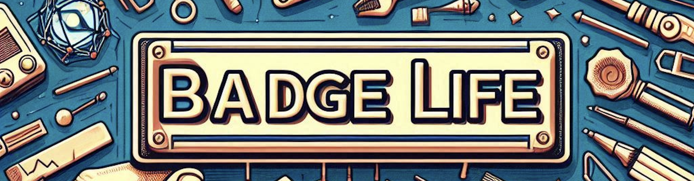

# Welcome to the Badgelife Archive!

Welcome to the **Badgelife Archive**, the first community maintained collection for electronic badge information! Our mission is to document and share everything related to custom badges, from pictures and schematics to source code and news about the latest releases.

## Explore the collection

### 📚 Badge Archive

Discover detailed information about various electronic badges, including:
- **Pictures:** High-quality images showcasing badge designs.
- **Schematics:** Circuit diagrams and technical drawings.
- **Source Code:** Access the firmware and software behind the badges.

Visit the [Badge Archive](/archive) to explore.

## Stay on top of the latest

### 🆕 DC32 Badges

Stay updated with the latest in badge innovation. Our [New Badges](/dc32) section features:
- **Announcements:** Information on new and upcoming badges.
- **Submit Information:** Working on a DC32 badge? Get it on the list, form is located [Here](https://t.co/UhN5iChYvH) (credit: K4rm4ness)
- **View Latest:** See whats coming in the latest curated list, located [Here](https://t.co/JUbgMb3Lze) (credit: K4rm4ness)

Check out the [DC32 Badges](/dc32) page for the latest updates.

## Browse Maker Resources

Find key resources to aid your badge-making journey, including community-acknowledged specifications and practical guides.

### 📝 Community Acknowledged Specifications

Access detailed and reliable specifications developed and vetted by our community to assist in your badge designs:

### 📚 Guides & Best Practices

Enhance your badge-making skills with guides and best practices shared by experienced makers in our community:

## Get Involved

### 🛠 Contribute

Join our community of makers and contribute to the archive. Here’s how you can participate:
- **Join Discussions:** Participate in our [Discord server](https://discord.gg/your-invite-link) to discuss badges and collaborate on new projects.
- **Add your Badge:** Have a badge you'd like to add to the Archive? Submit a PR and get it included! Be sure to include source code, schematics, etc. or links to badge repos if already hosted somewhere.

## Latest Blog Posts

Catch up on our recent articles and updates:


- [{{ post.title }}]({{ post.url }}) - {{ post.date | date: "%B %d, %Y" }}


## Join Us

We’re always looking for new members to join our vibrant community. Whether you’re a seasoned badge creator or just getting started, there’s a place for you here:
- **[Join our Discord](https://discord.gg/your-invite-link)**
- **[Subscribe to our Newsletter](#)**

## About Us

Learn more about our mission and the team behind the Badgelife Archive on our [About](/about) page.

